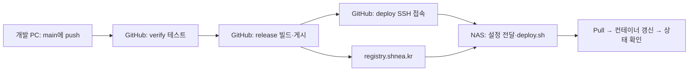

# GitHub Actions 배포 안내

## 평소에는 무엇을 하면 되나요?

개발 PC에서 수정한 코드를 검증하고 `main`에 커밋·푸시한다. 이후 GitHub Actions가 검사, 이미지 빌드·게시, NAS SSH 배포를 차례로 실행한다. 개발 PC는 푸시 뒤 꺼도 된다.

**확인 화면:** [Platform Actions](https://github.com/shnea/platform/actions) → 해당 커밋의 실행 → `verify / release / deploy`가 모두 성공했는지 확인한다. `release`만 성공했다면 운영 배포가 끝난 것이 아니다.



## 역할과 위치

아래 경로 변수는 위치를 설명하는 이름이다. 실제 NAS 경로·접속 정보는 저장소에 기록하지 않는다. `NAS_DEPLOY_PATH`는 NAS의 루트 소유 배포 진입점에 별도 설정하고, `PLATFORM_DATA_ROOT`는 암호화된 `.env.prod`에서 관리한다. 수동 명령의 `NAS_DEPLOY_PATH`는 해당 NAS 셸에서 실제 경로로 지정해야 한다.

| 위치 | 역할 | 주요 내용 |
| --- | --- | --- |
| 개발 PC | 코드 수정·수동 개발 | `scripts/dev.ps1`, Git push |
| GitHub `shnea/platform` | CI/CD 전체 흐름 제어 | `.github/workflows/platform.yml` |
| GitHub 실행 서버 | 테스트·이미지 Build/Push·SSH 요청 | 운영 복호화 키 불필요 |
| `registry.shnea.kr` | 완성된 이미지 보관 | `platform-*:<Git SHA 앞 12자리>` |
| GitHub Secret의 NAS 주소·포트 | SSH 배포 요청 수신 | `NAS_SSH_USER`, 배포 전용 키 |
| NAS `${NAS_DEPLOY_PATH}` | 운영 구성·실행 | 이미지 Pull·기동·상태 기록 |
| NAS `${PLATFORM_DATA_ROOT}` | 영속 데이터 | postgres / files / loki |
| NAS `${NAS_ARCHIVE_PATH}` | 이전 자료 보관 | 전환 백업·이전 구성·일회성 설치 자료 |

NAS에 GitHub Runner나 정기 조회 작업을 설치하지 않는다. GitHub 실행 서버가 SSH로 배포를 직접 요청하며 NAS에서는 애플리케이션을 빌드하지 않는다.

## 언제 실행되나요?

- `main`에 push: 검사 → 이미지 게시 → 운영 배포. 같은 브랜치 작업은 동시에 배포하지 않는다.
- main 대상 Pull Request: 검사만 실행한다. Registry·NAS 비밀값과 운영 배포는 제공하지 않는다.
- GitHub의 Run workflow: main의 전체 흐름을 수동 시작한다. 이미 게시한 SHA는 덮어쓰지 않으므로 동일 커밋의 전체 재실행은 release에서 거부될 수 있다.
- `docs/STATUS.md`만 바뀐 커밋은 자동 실행하지 않는다. 실행 결과 기록 때문에 또 배포되는 것을 피한다.

`verify`는 키 제외·암호문 검사, 배포 스크립트 실패 처리, 에디터·관리자 테스트/빌드, 격리 DB를 사용하는 백엔드 테스트를 수행한다. 테스트 DB는 운영·개발 DB와 분리한다.

`release`는 기존 `scripts/release.ps1`을 실행한다. 자체 이미지 8개를 같은 SHA로 게시하고 이미지 digest를 기록한다. 전부 성공해야 운영 구성 묶음을 전달한다. Compose·암호화 환경파일·스크립트·운영 설명서가 포함되며 소스·Private Key·사용자 데이터는 제외한다.

`deploy`는 해당 실행의 구성 묶음을 내려받고, NAS의 확인된 호스트 키로 접속한다. 전용 SSH 키는 `check` 또는 `deploy <전체 SHA>`만 허용한다. 일반 셸·포트 전달·임의 SSH 명령에는 사용할 수 없다. NAS의 루트 소유 게이트웨이가 파일 허용 목록·출처·배포 잠금을 확인하고 이전 설정을 보관한 뒤 기존 `deploy.sh`를 실행한다. 이미지 revision·게시 digest·Compose 상태·Loki·진입 API 확인을 통과해야 성공이다.

## 비밀정보는 어디에 있나요?

| 항목 | 저장 위치 |
| --- | --- |
| Registry 계정·암호 | GitHub Actions Secrets: `REGISTRY_USERNAME`, `REGISTRY_PASSWORD` |
| NAS 접속 주소·포트·계정 | GitHub Actions Secrets: `NAS_SSH_HOST`, `NAS_SSH_PORT`, `NAS_SSH_USER` |
| 배포 전용 개인키 | GitHub Actions Secret: `NAS_SSH_KEY` |
| 확인된 NAS 호스트 키 | GitHub Actions Secret: `NAS_SSH_KNOWN_HOSTS` |
| 운영 설정 루트 | NAS 배포 진입점의 별도 설정. GitHub `NAS_DEPLOY_PATH` Secret에도 등록해 로그에서 가림 |
| 운영 설정 | NAS `.env.prod` — Git에도 암호문만 저장 |
| 운영 복호화 키 | NAS `.secrets/prod.keys` — GitHub에 올리지 않음 |
| SSH 공개키·실행 제한 | NAS 배포 계정의 `.ssh/authorized_keys` |
| 제한된 sudo 규칙 | NAS 관리자가 별도 설치·관리 |
| 루트 소유 배포 진입점 | NAS 관리자가 별도 설치하며 실제 경로는 운영 설정에서 관리 |

호스트 키 변경 오류가 나면 NAS 교체·재설치 여부를 확인한 뒤 신뢰할 수 있는 경로에서 새 키를 확인하고 Secret을 바꾼다. `StrictHostKeyChecking=no`로 우회하지 않는다. 전용 키를 폐기할 때는 NAS의 해당 공개키 줄과 GitHub Secret을 함께 제거한다. 기존 개인 로그인 키는 보존한다.

## 상태·로그 확인

NAS SSH에서:

```sh
cd "$NAS_DEPLOY_PATH"
sudo sh scripts/deploy.sh status
sudo sh scripts/deploy.sh logs project-service
sudo cat .deploy/current
sudo tail -20 .deploy/history
sudo tail -20 .deploy/ssh-history
```

외부 서비스 주소는 **https://platform.shnea.kr**이다. `storage-init`·`identity-setup`의 `Exited (0)`은 정상이다. `.deploy/current`는 마지막 정상 배포 태그이며, 실패 중 일부 컨테이너가 새 이미지로 바뀌었을 수 있으므로 상태와 함께 확인한다.

## 실패했을 때

| 실패 단계 | 운영 영향 | 다음 행동 |
| --- | --- | --- |
| verify | 기존 운영 유지 | 테스트 오류 수정 후 새 커밋 push |
| release | 기존 운영 유지 | 빌드·Registry 오류 확인. 일부 게시된 태그를 덮어쓰지 않고 수정 후 새 커밋으로 재시도 |
| SSH 접속·인증 | 기존 운영 유지 | 외부 주소·NAS_SSH_PORT 포트·키·호스트 키·sudo 설정 확인 |
| 설정 사전 검사 | 기존 운영 유지 | 오류를 수정하고 같은 deploy 작업 또는 새 릴리스로 재시도 |
| Pull·이미지 식별 확인 | 컨테이너 갱신 전 중단 | Registry 접근과 게시된 SHA·digest 확인. 전달된 새 설정은 이미 배치되었을 수 있음 |
| 기동·상태 확인 | 일부 갱신됐을 수 있음 | GitHub deploy 로그와 NAS 상태 확인. 실패를 성공으로 기록하지 않음 |

release는 성공했고 deploy만 실패했다면 GitHub의 **Re-run failed jobs**로 실패한 배포 작업을 재실행한다. 성공한 이미지를 다시 빌드해 같은 태그에 덮어쓰지 않는다. Artifact 보관 기간(90일)이 지났다면 Git과 Registry의 기존 릴리스 자료로 수동 배포하거나 새 커밋을 릴리스한다.

## 수동 배포·롤백

자동 배포와 같은 스크립트를 사용한다.

```sh
cd "$NAS_DEPLOY_PATH"
sudo sh scripts/deploy.sh <실제_게시된_SHA_12자리>
```

롤백 전 GitHub에서 실행 중인 작업을 확인한다. 자동 배포가 진행 중이면 완료를 기다리고, 새 push를 멈춘다. 필요하면 GitHub Actions에서 워크플로를 비활성화한 뒤 조치한다. **이미지 롤백은 DB·파일 복원이 아니다.** DB 스키마와 이전 설정의 호환성을 먼저 확인한다.

SSH 배포는 `.deploy/configs/<이전 정상 태그>`에 이전 운영 설정을 보관한다. 현재 구성과 호환되지 않는 과거 이미지를 배포할 때는 이 폴더에서 Compose·환경파일·Loki 설정을 검토해 복원하고 해당 태그로 deploy한다. 복호화 키를 바꿨다면 이전 설정을 읽을 수 있는지도 확인한다. 무조건 디렉터리 전체를 덮어쓰는 자동 롤백은 제공하지 않는다.

전환 전 버전 복구는 보호된 `0.1.3`에 한해 `sudo sh scripts/deploy.sh --legacy 0.1.3`을 사용한다. `.deploy/legacy-images`에 기록한 이미지 ID와 일치해야 한다.

## 운영 폴더와 백업

```text
platform/
├─ 운영안내.html                 # 이 폴더에서 바로 열어 보는 설명서
├─ compose.yml
├─ .env.prod                    # 암호문
├─ scripts/deploy.sh
├─ infra/loki/loki.yml
├─ .tools/dotenvx
├─ .secrets/prod.keys
├─ .deploy/                     # 상태·잠금·digest·이전 설정
└─ docs/                        # 자세한 운영·CI/CD·프록시 문서
```

`platform_tmp`는 운영 실행에 사용하지 않는다. 이전 평문 환경 백업이 있으므로 접근을 제한한다. `.deploy/configs`는 현재 롤백에 필요한 운영 기록이므로 잔재로 취급해 이동하지 않는다. Registry 자동 이미지 삭제는 별도 작업이며 현재·직전 정상·보호 이미지는 삭제하지 않는다.

## 참고

- [GitHub Actions 기본 개념](https://docs.github.com/en/actions/get-started/understand-github-actions)
- [GitHub Actions Secrets](https://docs.github.com/en/actions/how-tos/write-workflows/choose-what-workflows-do/use-secrets)
- [Artifact로 작업 간 데이터 전달](https://docs.github.com/en/actions/how-tos/writing-workflows/choosing-what-your-workflow-does/storing-and-sharing-data-from-a-workflow)
